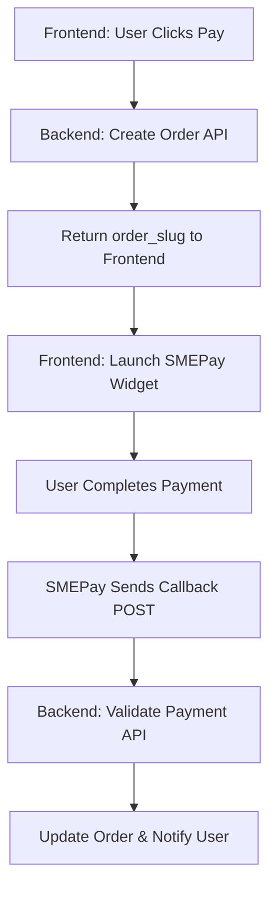

---

# 💳 SMEPay V2 Integration Guide

### **For IOTCOM Applications**

**Version:** 2.0
**Integration Type:** Node.js (Backend) + React (Frontend)
**Prepared for:** IOTCOM Development Team
**Theme:** Modern (Blue Developer Style)

---

## 🧭 Overview

This document provides a step-by-step guide for integrating **SMEPay V2** payment gateway into IOTCOM’s Node.js + React application.

The integration follows the standard flow:

> **Authenticate → Create Order → Launch Widget → Validate Payment → Check Status**

The APIs can operate in two environments — **Test** and **Live** — which must be used carefully during development and production deployment.

---

## 🌐 Environments

| Environment | Base URL                     | Description                                                  |
| ----------- | ---------------------------- | ------------------------------------------------------------ |
| **Test**    | `https://extranet.smepay.in` | Used for internal testing and QA. No real money is involved. |
| **Live**    | `https://extranet.smepay.in` | Used in production for real transactions.                    |

> ⚠️ **Important:**
> Your `client_id` and `client_secret` are bound to either **Test** or **Live**.
> Make sure your API calls match the correct environment.
> Example: If you authenticate with Test credentials, all subsequent API calls must go to the **Test host**.

---

## ⚙️ How to Use the Test Environment During Development

During local or staging development:

1. Use your **Test Mode Client ID** and **Client Secret**.
2. All API requests should use the **Test Environment Base URL:**
   `https://extranet.smepay.in`
3. Set a **dummy callback URL**, e.g.
   `https://dev.iotcom.in/payment/callback`
   (or your localhost tunnel such as `https://abc123.ngrok.io/payment/callback`)
4. Verify flows end-to-end using sandbox payment methods.
5. Once tested, simply:

   * Replace credentials with **Live Mode** ones.
   * Keep the same API code structure.

---

## 🔐 1. Authentication API

**Endpoint:**
`POST https://extranet.smepay.in/api/wiz/external/auth`

### Purpose

Generate an access token (Bearer token) used for all subsequent API calls.

### Request Body

```json
{
  "client_id": "YOUR_CLIENT_ID",
  "client_secret": "YOUR_CLIENT_SECRET"
}
```

### Node.js Example

```js
var axios = require('axios');

var data = JSON.stringify({
  client_id: "YOUR_CLIENT_ID",
  client_secret: "YOUR_CLIENT_SECRET"
});

var config = {
  method: 'post',
  url: 'https://extranet.smepay.in/api/wiz/external/auth',
  headers: { 'Content-Type': 'application/json' },
  data: data
};

axios(config)
  .then((response) => console.log("✅ Auth Token:", response.data))
  .catch((error) => console.error(error));
```

---

## 🧾 2. Create Order API

**Endpoint:**
`POST https://extranet.smepay.in/api/wiz/external/order/create`

### Purpose

Create a new order and receive a unique `order_slug` to launch the SMEPay Checkout widget.

### Headers

```
Authorization: Bearer <token>
Content-Type: application/json
```

### Request Body

```json
{
  "client_id": "YOUR_CLIENT_ID",
  "amount": "100",
  "order_id": "ORDER1234",
  "callback_url": "https://dev.iotcom.in/payment/callback",
  "customer_details": {
    "email": "user@example.com",
    "mobile": "9999999999",
    "name": "John Doe"
  }
}
```

### Node.js Example

```js
var axios = require('axios');

var data = JSON.stringify({
  client_id: "YOUR_CLIENT_ID",
  amount: "100",
  order_id: "ORDER1234",
  callback_url: "https://dev.iotcom.in/payment/callback",
  customer_details: {
    email: "user@example.com",
    mobile: "9999999999",
    name: "John Doe"
  }
});

var config = {
  method: 'post',
  url: 'https://extranet.smepay.in/api/wiz/external/order/create',
  headers: { 
    'Authorization': 'Bearer YOUR_TOKEN',
    'Content-Type': 'application/json'
  },
  data: data
};

axios(config)
  .then((response) => console.log("✅ Order Created:", response.data))
  .catch((error) => console.error(error));
```

---

## 💳 3. Frontend (React / JS) Integration

### Step 1: Include SMEPay Checkout Script

In `public/index.html`:

```html
<script src="https://extranet.smepay.in/sdk/smepay-checkout.js"></script>
```

### Step 2: Launch Checkout Wizard

Once you receive the `order_slug` from the backend, open the SMEPay widget:

```js
const handleOpenSMEPay = (slug) => {
  if (window.smepayCheckout) {
    window.smepayCheckout({
      slug: slug,
      onSuccess: (data) => {
        console.log("✅ Payment Successful:", data);
        if (data.callback_url) window.location.href = data.callback_url;
      },
      onFailure: () => {
        console.log("❌ Payment failed or cancelled.");
      },
    });
  } else {
    alert("SMEPay widget is not loaded.");
  }
};
```

### Example Integration with Backend

```js
function initiatePayment(orderId) {
  fetch(`/api/pay/${orderId}`)
    .then((res) => res.json())
    .then((response) => {
      handleOpenSMEPay(response.order_slug);
    })
    .catch((err) => console.error("Error creating order:", err));
}
```

> 💡 The widget will automatically close after successful payment and redirect to your `callback_url`.

---

## ✅ 4. Validate Payment

**Endpoint:**
`POST https://extranet.smepay.in/api/wiz/external/order/validate`

### Purpose

Confirm payment status after redirection or via webhook.

### Headers

```
Authorization: Bearer <token>
Content-Type: application/json
```

### Request Body

```json
{
  "client_id": "YOUR_CLIENT_ID",
  "amount": "100",
  "slug": "ORDER_SLUG"
}
```

### Node.js Example

```js
var axios = require('axios');

var data = JSON.stringify({
  client_id: "YOUR_CLIENT_ID",
  amount: 100,
  slug: "ORDER_SLUG"
});

var config = {
  method: 'post',
  url: 'https://extranet.smepay.in/api/wiz/external/order/validate',
  headers: { 
    'Authorization': 'Bearer YOUR_TOKEN',
    'Content-Type': 'application/json'
  },
  data: data
};

axios(config)
  .then((response) => console.log("✅ Payment Validation:", response.data))
  .catch((error) => console.error(error));
```

---

## 🔁 5. Check Payment Status (Optional)

**Endpoint:**
`POST https://extranet.smepay.in/api/external/order/status`

### Purpose

Poll the real-time payment status for an order.

### Request Body

```json
{
  "order_id": "EXT-2025-0001"
}
```

### Example

```js
var axios = require('axios');

var data = JSON.stringify({
  order_id: "EXT-2025-0001"
});

var config = {
  method: 'post',
  url: 'https://extranet.smepay.in/api/external/order/status',
  headers: { 
    'Authorization': 'Bearer YOUR_TOKEN',
    'Content-Type': 'application/json'
  },
  data: data
};

axios(config)
  .then((response) => console.log("📊 Order Status:", response.data))
  .catch((error) => console.error(error));
```

---

## 🧩 6. Integration Flow



---

## 🧠 Developer Notes

* Keep **Auth token** cached; avoid regenerating for every transaction.
* Ensure all **API endpoints** and **environment variables** are properly switched for production.
* Your **callback URL** must handle a POST request from SMEPay.
* Always log SMEPay responses for debugging and audit trails.
* Use **HTTPS** for callback and payment pages in production.

---

## 🧰 Example Folder Structure

```
iotcom-project/
│
├── backend/
│   ├── server.js
│   ├── routes/
│   │   └── smepay.js
│   ├── controllers/
│   │   └── smepayController.js
│   └── utils/
│       └── axiosInstance.js
│
└── frontend/
    ├── public/index.html      # Include smepay-checkout.js
    ├── src/
    │   ├── components/PaymentButton.js
    │   └── api/smepayService.js
```

---

## ✅ Summary

| Step | Description             | API / Action                       |
| ---- | ----------------------- | ---------------------------------- |
| 1    | Authenticate            | `/api/wiz/external/auth`           |
| 2    | Create Order            | `/api/wiz/external/order/create`   |
| 3    | Launch Widget           | Frontend (React)                   |
| 4    | Validate Payment        | `/api/wiz/external/order/validate` |
| 5    | Check Status (optional) | `/api/external/order/status`       |

---

**Company:** IOTCOM
**Prepared By:** ChatGPT (GPT-5)
**Date:** November 2025
**Theme:** Modern Developer Style (Blue)

---

